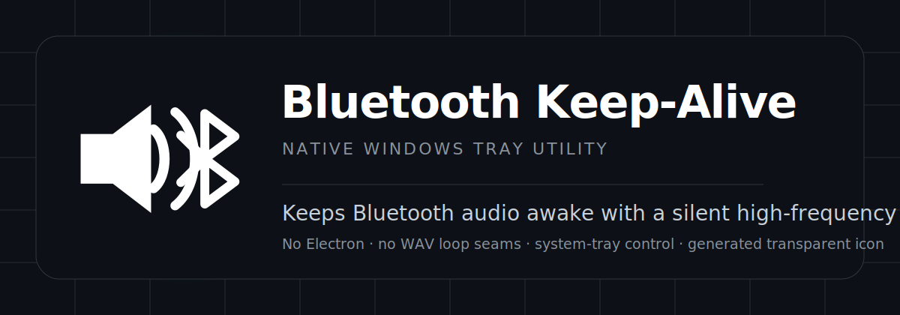
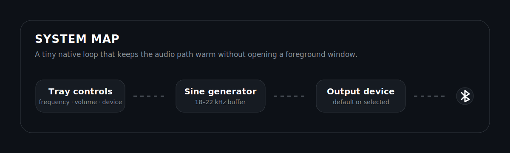

<div align="center">



<br>

<a href="https://github.com/Yannam-Builds/Bluetooth-Keep-Alive/releases"></a>


</div>

---

## 01 · What it solves

Bluetooth headphones, speakers, and soundbars often enter standby during short silent gaps. When sound resumes, the device wakes late and cuts off the beginning of the audio.

**Bluetooth Keep-Alive** keeps the audio path warm by generating a quiet high-frequency sine wave in the background. No visible window. No browser. No Electron wrapper. No looped WAV seam clicks.

## 02 · Why it is clean

| Area | Decision |
|---|---|
| **Runtime** | Single native Windows tray utility. No Electron or Python dependency. |
| **Audio path** | Generated sine-wave buffer instead of a looping audio file. |
| **Interface** | System tray only; no heavy foreground UI. |
| **Controls** | Frequency, volume, output device, mute/play, restart stream, and start-on-boot. |
| **Power behavior** | Pauses on lock/suspend and resumes after unlock/resume. |
| **Branding** | The supplied transparent logo is used across the README, header, system map, tray icon, and executable. |

<p align="center">
  
</p>

## 03 · Features

- **System tray control surface** — right-click the tray icon to manage the app.
- **Frequency range** — switch between `18 kHz`, `19 kHz`, `20 kHz`, `21 kHz`, and `22 kHz`.
- **Volume tuning** — choose from `1%`, `5%`, `10%`, `25%`, `50%`, or `100%`.
- **Per-device routing** — send the keep-alive signal to the default output device or a selected device.
- **Smart power handling** — pause on system lock/suspend to avoid wasting Bluetooth battery.
- **Start on Windows boot** — optional registry-based startup toggle.

## 04 · Usage

1. Download `BluetoothKeepAlive.exe` from **Releases**.
2. Run it.
3. Look for the white keep-alive logo in the Windows system tray.
4. Right-click the icon to adjust frequency, volume, output device, startup behavior, or mute/play state.

## 05 · Build from source

No Visual Studio project is required. The build script uses the C# compiler included with Windows and embeds the checked-in multi-resolution icon directly into the executable.

```powershell
.\build.ps1
```

## 06 · Project layout

```text
Bluetooth-Keep-Alive/
├─ Program.cs                 # Native tray app, audio engine, routing and settings
├─ build.ps1                  # One-command Windows build
├─ app.ico                    # Multi-resolution Windows executable/tray icon
├─ assets/
│  ├─ logo.png                # Transparent project logo
│  ├─ header.svg              # Repository header using the same logo
│  └─ system-map.svg          # Signal-flow panel using the same logo
├─ LICENSE
└─ README.md
```

## 07 · Visual identity

The logo is not redrawn in the repository artwork. `assets/logo.png` is referenced by both the header and system map, while `app.ico` supplies the Windows icon sizes used by the executable and system tray.

---

<div align="center">


<br>

<sub>1 silent stream a day keeps the Bluetooth awake.</sub>

</div>
